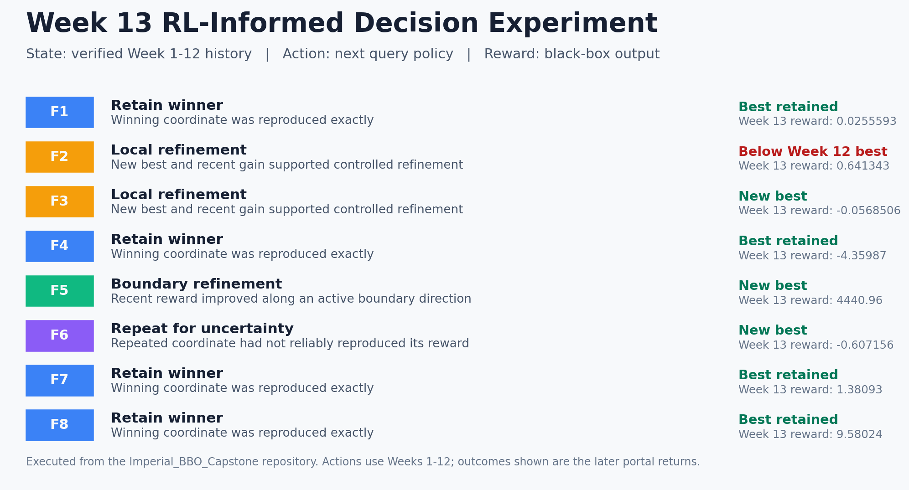

# Stage 2: Required Capstone Component 25.1

## Retrospective on the BBO Capstone Project: Section B

### 1. Initial codebase and repository

The 13-week BBO challenge began with starter data supplied by the course for eight unknown functions. For each function, `initial_inputs.npy` contained coordinates that had already been tested, while `initial_outputs.npy` held the results. The amount of starter data increased with dimensionality, from 10 points for each two-dimensional function to 40 points for the eight-dimensional function. We were not given the equations, gradients or locations of the optima.

I built the codebase from scratch for this challenge rather than copying a public repository or adapting earlier work. I wanted a clear structure that could preserve the exact history of eight functions with different dimensions and still allow the method to change as the evidence grew. The course recommended Bayesian optimisation and showed how NumPy could load and append data. I then developed the weekly comparisons, candidate selection, figures, validation checks and decision records within my own project, using established Python libraries for standard numerical tasks.

The weekly cycle was straightforward but demanding. I reviewed every available input-output pair, selected one new coordinate for each function and submitted the eight numerical strings through the BBO portal. Once they had been processed, the portal returned the corresponding outputs. I added those results to the growing dataset, examined what had improved or deteriorated and used that evidence to choose the next inputs. The same process continued until the Week 13 outputs were received. The repository therefore records 104 weekly queries made as the challenge unfolded.

This distinction matters when describing the starting point. The starter arrays were observations supplied by the course, not code and not results generated by me. My contribution began with organising those observations into a reproducible workflow, then writing the routines that compared candidates and supported each weekly decision. The portal remained the only source of authoritative black-box outputs. I did not substitute model predictions for returned values or treat a candidate forecast as an achieved result.

The public record is available in the [Imperial BBO Capstone repository](https://github.com/tpnandakumar/Imperial_BBO_Capstone). It preserves unsuccessful trials as well as successful ones because both affected later decisions.

### 2. How the approach changed across the 13 weeks

I began cautiously. In Week 1, I found the strongest supplied observation for each function and made a small, manually selected adjustment around it. This gave me the first outputs from coordinates I had chosen myself. From then onwards, it became clear that the eight functions could not share one optimiser, direction or step size.

| Week | Development of the approach |
| --- | --- |
| 1 | Loaded the supplied arrays, identified each best starter observation and submitted nearby local probes. |
| 2 | Used the first returned outputs to separate promising functions from those needing wider exploration. F5 became the clearest exploitation target. |
| 3 | Compared direction as well as value. F5 improved again, F1 produced its first visible positive result and declines in F2, F7 and F8 warned against mechanical continuation. |
| 4 | Used different movement sizes by function. F2, F3 and F8 recovered, while F4 deteriorated, demonstrating that simple momentum was unreliable. |
| 5 | Continued controlled exploitation of F5 and found a strong F7 point, while poor results elsewhere justified changing direction. |
| 6 | Pushed several coordinates aggressively towards boundaries. F5 improved, but deterioration in other functions showed the cost of overextending a weak trend. |
| 7 | Retained the productive F5 direction and moderated movements elsewhere. F5 reached another new best. |
| 8 | Shifted from broad movement to more structured local probing around historically stronger regions. F5 improved to `4359.384134322703`. |
| 9 | Tightened the search and formalised reproducible summaries, figure data and validation checks. F5 improved again to `4394.868042481448`. |
| 10 | Used clustering to examine recurring local regions, productive basins and failed basins. Hyperparameter checks, including repeated initialisations, tested whether the structural interpretation was stable. |
| 11 | Used PCA to examine variance, correlated coordinate movement and redundancy in the higher-dimensional search paths. The objective outputs remained the primary decision evidence. F1, F4, F5, F6 and F8 improved relative to Week 10. |
| 12 | Combined the full history, movement size, previous best status and PCA evidence. F2, F3 and F5 achieved new bests, while F1, F4, F7 and F8 reproduced earlier winners. |
| 13 | Used a predominantly exploitative final portfolio: retain confirmed winners, make small local changes for F2 and F3, continue the evidenced F5 boundary direction and repeat F6 to investigate variability. |

The codebase grew with the analysis. Early scripts loaded, ranked and compared observations. Later work added verified input and result files, automatic checks for dimensions and bounds, exact change calculations, clustering, PCA, reproducible figures, model cards, datasheets and decision records. This made the project easier to audit while preserving the reasoning used at each stage.

The most important change was replacing a common search rule with a separate strategy for each function. This allowed me to continue the productive F5 direction, recover stronger earlier coordinates for F4, F7 and F8, and make cautious late adjustments to F2 and F3. The validation checks were also valuable because they kept rounded, reconstructed or dimensionally invalid values out of the final comparisons.

There was also a change in how I used predictions. At first, a promising predicted value could appear persuasive on its own. As the project progressed, I treated it as one piece of evidence alongside distance from the best observation, uncertainty, recent movement and the cost of losing the next query. This was particularly important in the final weeks. A visually smooth model fit could conceal a narrow peak, while a conservative repeat could be more informative than another speculative move. The weekly record therefore became as important as the optimiser itself.

### 3. Final results and performance trajectory

The final round produced three new overall best outputs, for F3, F5 and F6. F1, F4, F7 and F8 retained their established best values. F2 remained strongest in Week 12 because the final local adjustment reduced its output.

| Function | Strongest verified output | Best week or weeks | Final interpretation |
| --- | ---: | --- | --- |
| F1 | `0.025559285339829783` | 3, 11, 12, 13 | Winner repeatedly confirmed |
| F2 | `0.7335252043269003` | 12 | Week 13 crossed away from the stronger local point |
| F3 | `-0.05685061601567621` | 13 | Final local adjustment produced a new best |
| F4 | `-4.359874926582439` | 1, 12, 13 | Early winner recovered and retained |
| F5 | `4440.957216598753` | 13 | Sustained boundary refinement produced a new best |
| F6 | `-0.6071562248604215` | 13 | New best, with response variability at an identical coordinate |
| F7 | `1.3809299933612855` | 5, 12, 13 | Earlier winner recovered and confirmed |
| F8 | `9.58024` | 1, 11, 12, 13 | Early winner repeatedly confirmed |

F5 showed the clearest optimisation trajectory, rising from `1415.8763939603884` in Week 1 to `4440.957216598753` in Week 13, a gain of `3025.0808226383646`. Its improvement was not produced by a single large jump. It emerged through repeated, controlled movement as the first coordinate decreased and the remaining coordinates approached the upper boundary.

The other functions show why the final score cannot tell the whole story. F4 and F8 were strongest early, weakened during exploration and were later recovered. F2 peaked in Week 12 at `0.690000,0.950000`, yet moving the first coordinate by only `0.005000` reduced the Week 13 output by `0.0921821158135095`. F6 returned three different outputs from the same coordinate in Weeks 3, 12 and 13. This showed genuine response variability, although the available evidence could not determine its cause.

These are the best verified observations within the authorised query budget. They do not prove that the global mathematical optima were found.

The final weeks showed three distinct forms of progress. F3 and F5 improved through carefully directed local movement. F6 improved through a repeated coordinate, which raised a separate question about response stability. F1, F4, F7 and F8 progressed through confirmation rather than a higher numerical result, because recovering and reproducing an earlier winner reduced uncertainty about what should be retained. F2 was the useful counterexample. Its final decline showed that a small coordinate change is not necessarily a small decision when the response surface is steep.

### 4. Trade-offs and decision quality

The main trade-off was exploration against exploitation. Early exploration was necessary because the supplied observations were sparse, particularly for the higher-dimensional functions. However, every exploratory query used one of only 13 opportunities. Staying near a productive region protected a strong result, but it also risked settling around a local maximum.

Four practical actions emerged: explore, refine, recover and retain. F5 justified continued refinement because several controlled movements produced further gains. F4 needed recovery after broader exploration moved well below its Week 1 result. F1, F7 and F8 could eventually be retained because their winning coordinates were reproducible. F2 showed that even a very small local step could move beyond a narrow productive region.

Clustering helped me recognise recurring neighbourhoods, although sparse and sequentially sampled data can create unstable groups. PCA showed where coordinates moved together and where much of the search followed one direction. Neither method could reveal the hidden objective directly, so I always checked its interpretation against the returned outputs.

The final round carried more risk because there would be no later query to recover from a poor experiment. I therefore retained F1, F4, F7 and F8, made small changes to F2 and F3, continued the supported F5 direction and repeated F6. The outcome supported this function-by-function approach, even though the F2 adjustment did not succeed.

I also had to balance short-term score improvement against learning that might help later rounds. A broad probe could reveal a new basin but produce a poor immediate value. A repeated coordinate might not improve the leaderboard, yet it could test whether an apparent winner was stable. Early in the challenge I could accept more of that learning cost because several future rounds remained. By Week 12, the value of new information had fallen because only one decision was left. That is why the Week 13 portfolio contained a mixture of preservation, local refinement and one deliberate repeat rather than eight aggressive searches.

Before choosing the Week 13 inputs, I also analysed the 12-week history through reinforcement learning concepts. I treated each coordinate as an action, the returned output as its reward and the accumulated history as the current state of knowledge. Multi-armed bandit reasoning helped me decide where to explore, refine or preserve a known winner. The MDP view was useful because every returned result changed the information available for the next decision. Q-learning principles supported comparison and updating of rewarded actions, although the small continuous dataset was not suitable for a stable tabular Q-function. Together, these ideas helped shape the final choices: retain F1, F4, F7 and F8, refine F2 and F3 locally, continue the rewarded F5 boundary direction and repeat F6 to examine unresolved variability.

*Figure 1. Executed state-action-reward experiment using the verified Week 1 to Week 12 history, followed by the returned Week 13 outcomes.*

### 5. Learning, surprises and future application

The greatest change in my thinking was moving away from the search for one superior algorithm. In practice, I was managing eight different evidence problems. Dimensionality mattered, but observed behaviour mattered more. Some functions rewarded boundary movement, some had narrow productive regions, some required recovery and some showed different outputs at repeated coordinates.

If I started again, I would establish the data pipeline, validation rules and experiment register in Week 1. I would separate queries intended to improve performance from those intended to test repeatability, calculate movement and uncertainty consistently, and define stopping rules for each function. I would also use Bayesian surrogate models and acquisition functions more systematically from the outset, compare them with clear baselines and retain human review where the evidence remained sparse.

I would also reserve part of the early query budget for planned controls. Repeating selected starter coordinates would help distinguish noise from genuine landscape structure before directional strategies became entrenched. For higher-dimensional functions, I would use space-filling candidates early, then narrow the region only after several independent signals agreed. Every proposed point would be recorded with its purpose, expected benefit, uncertainty and fallback action before portal submission. That discipline would make later reflection more precise and reduce the temptation to explain a result only after seeing it.

The capstone has direct relevance to clinical neurology service development. Improving a referral pathway, urgent-recall threshold or investigation policy also involves limited observations, unequal consequences and uncertain responses. A numerical winner should never be transferred blindly. The safer approach is to preserve provenance, test changes in sequence, distinguish improvement from random variation, protect high-risk cases and stop only when the evidence supports that decision. The project strengthened my preference for certainty over belief, while reminding me to state clearly what the data cannot establish.

What surprised me most was that identical coordinates did not always return identical outputs. F6 produced three different values at the same point, whereas the repeated winning coordinates for F1, F4, F7 and F8 reproduced their results exactly. I was also struck by the fact that the most sophisticated method was not automatically the most useful. Clustering, PCA and Gaussian process reasoning all added value, but the strongest decisions came from combining them with the complete history and careful judgement.

The project also changed how I judge success. A high final value matters, but so do traceability, calibration and knowing when not to move. The best evidence was not always the newest observation, and a failed query was not wasted if it ruled out an unsafe direction. In future optimisation work, I would report both the achieved result and the quality of the decision process that produced it. That gives others a fairer basis for reproduction, challenge and responsible use.

Finally, the work reinforced the value of communicating uncertainty plainly. A technical dashboard can make a recommendation look more certain than the underlying evidence warrants. For each function, I therefore tried to separate what had been observed, what the analysis suggested and what remained unknown. That habit is directly relevant to clinical discussions, where a clear account of uncertainty can be as important as the recommendation itself. It also makes collaboration easier because colleagues can question an assumption, repeat a test or choose a safer alternative without having to reconstruct the entire analysis.
