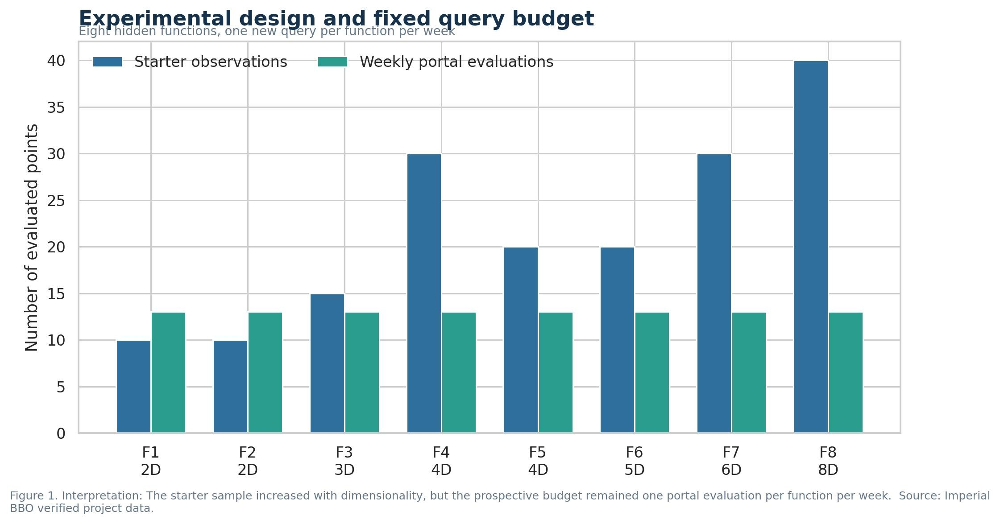
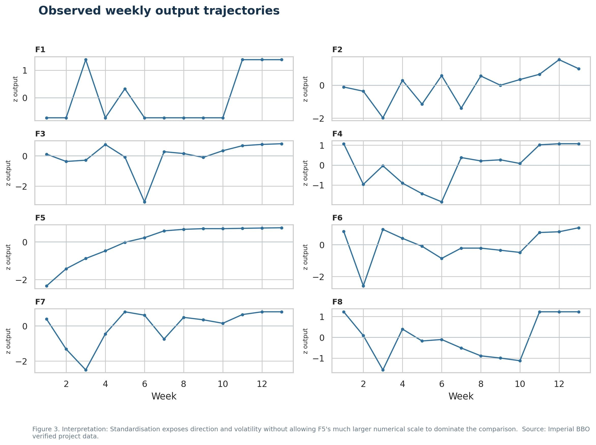
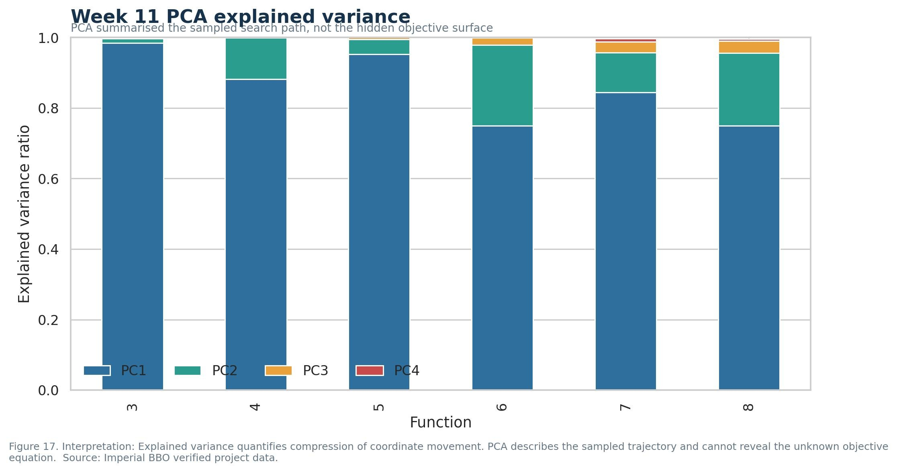
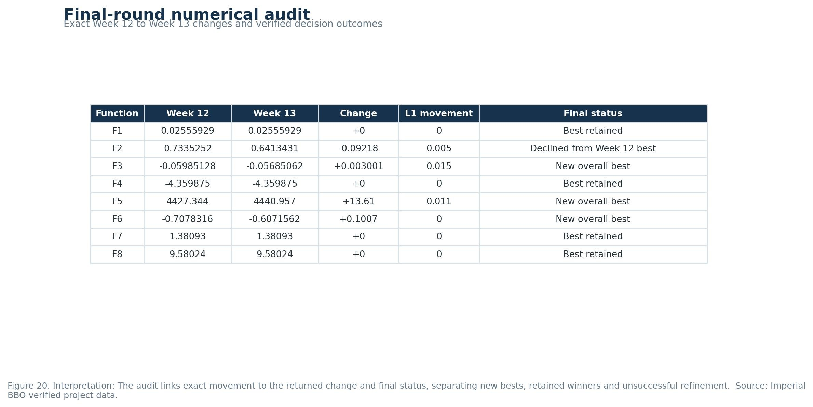

# BBO capstone retrospective and scientific evidence

This directory contains the 25.1 retrospective and its supporting technical evidence for the complete 13-round black-box optimisation project.

## 25.1 retrospective

`BBO_25_1_Academic_Retrospective_With_20_Figures.docx` is the concise narrative account of the project. It explains:

- the course-supplied starter observations and fixed query budget;
- the sequential portal workflow used to obtain authoritative outputs;
- how the strategy changed from Week 1 to Week 13;
- why separate policies emerged for the eight functions;
- how clustering, hyperparameter validation, PCA and reinforcement learning concepts were used;
- which decisions improved, retained or reduced performance;
- the final verified results, uncertainty and stopping decisions; and
- the lessons relevant to future optimisation and clinical neurology service development.

The retrospective is deliberately concise. The repository provides the additional technical depth, calculations and reproducibility information.

## Scientific figure set

The 20 numbered JPG figures in `academic_infographics/` are generated from repository-held project data. Each image includes an embedded caption, interpretation and source note. Together they provide:

1. experimental design and query-budget evidence;
2. a Week 1 to Week 13 method and decision record;
3. standardised objective trajectories and convergence analysis;
4. individual response or coordinate-path evidence for F1 to F8;
5. movement-size and boundary-proximity diagnostics;
6. clustering and surrogate hyperparameter comparisons;
7. PCA explained-variance and loading analysis;
8. prospective Week 13 policy evaluation; and
9. an exact final-round numerical audit.

`ACADEMIC_FIGURE_REGISTER.md` records the purpose, source, method and interpretation boundary for every figure.

## Selected retrospective infographics

The following figures give a concise visual route through the 25.1 Retrospective. They move from the experimental design and weekly trajectory to the later multivariate analysis and final numerical audit.

### Experimental design



### Weekly output trajectories



### Principal component analysis



### Final numerical audit



[Open the complete 20-figure register](ACADEMIC_FIGURE_REGISTER.md) for every infographic, its purpose, evidence source and interpretation boundary.

## Reproducibility

Run the following from the repository root:

```bash
python Module_25_Final_BBO_Submission/25_1_Retrospective/generate_academic_infographics.py
python Module_25_Final_BBO_Submission/25_1_Retrospective/build_discussion_word.py
```

The first command rebuilds all 20 figures. The second rebuilds the Word retrospective and places the figures beside the relevant narrative evidence.

## Evidence sources

The principal inputs are:

- `BBO_Dashboard/data/complete_internal_evidence.csv`
- `BBO_Dashboard/CAPSTONE_WEEK_STORY.csv`
- `BBO_Dashboard/hpo_results/week10_clustering_hpo_all_results.csv`
- `BBO_Dashboard/hpo_results/posthoc_surrogate_hpo_all_results.csv`
- `Week_13/RL_DECISION_EXPERIMENT/outputs/rl_week13_policy_results.csv`
- `Week_13/week_13_analysis_summary.csv`

The course portal outputs remain the authoritative observations. Predictions and retrospective analyses are retained as supporting evidence and are not substituted for returned black-box results.

## Interpretation limits

The reported best values are the strongest verified observations within the available starter data and 13-round query budget. They do not prove that a global optimum was reached. Clustering describes patterns within sparse sequential samples. PCA describes coordinate movement rather than the unknown objective equation. Surrogate validation is chronological but remains limited to the observed search path. F6 repeated-coordinate variability remains unresolved and requires a designed repeatability experiment before further optimisation.


