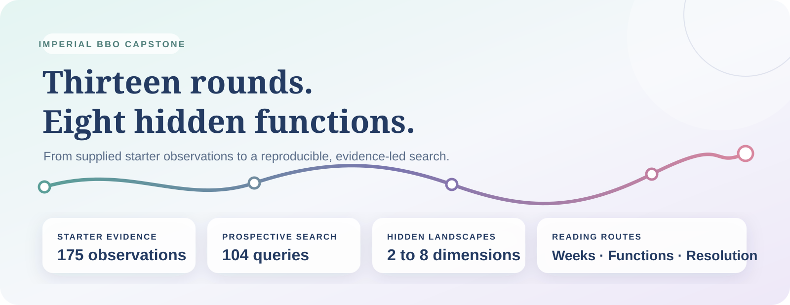
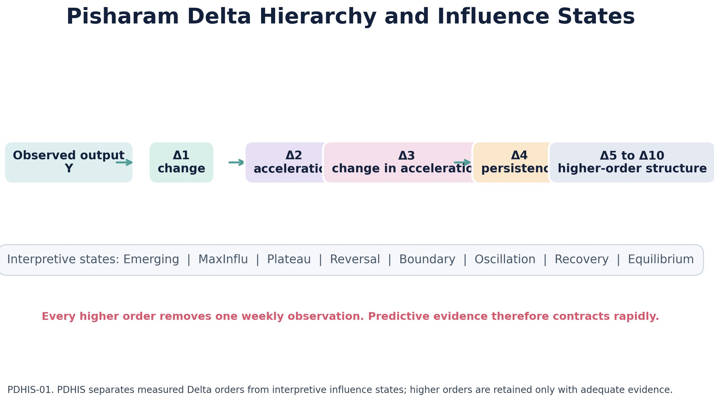

# Imperial BBO Capstone

This is the single authoritative README for the Imperial BBO Capstone. Supporting folders use clearly named section guides so that readers always return here for the required project overview, results and submission route.

**Author:** Dr Nandakumar Theekkootu Pisharam

**Repository status:** Public

**Default branch:** `main`

## NON-TECHNICAL EXPLANATION OF MY PROJECT

This project records a thirteen-round search for strong inputs to eight hidden mathematical functions. Imperial supplied 175 starting observations. Each week, I selected one new input per function, submitted eight queries through the course portal and used the returned outputs to plan the next round. The approach changed as evidence accumulated: broad exploration gave way to local refinement, recovery of earlier strong points, boundary testing, replication and stopping. Across 104 prospective queries, Round 13 produced new best results for Functions 3, 5 and 6. The repository preserves the data, unsuccessful trials, analysis code, figures, decisions, limitations and reproducibility checks.

### EXECUTIVE SUMMARY

[Open the detailed 2,000 to 2,500-word Executive Summary](Module_25_Final_BBO_Submission/25_1_Retrospective/DETAILED_EXECUTIVE_SUMMARY.md) for the full project narrative, strategy, principal findings, significance and conclusions.

#### HOW TO LISTEN

To listen while reading, keep the written Executive Summary open in one tab and use the clearly labelled recordings below. Start with Part 1, followed by Parts 2 and 3.

| Narration | Listen |
| --- | --- |
| Part 1: project design and the thirteen-round development | [Listen to Part 1](https://github.com/tpnandakumar/Imperial_BBO_Capstone/releases/download/executive-summary-narration-v1/07_executive_summary_part_1.m4a?version=2) |
| Part 2: final results, interpretation, trade-offs and stopping | [Listen to Part 2](https://github.com/tpnandakumar/Imperial_BBO_Capstone/releases/download/executive-summary-narration-v1/08_executive_summary_part_2.m4a) |
| Part 3: retrospective learning, accessibility and clinical application | [Listen to Part 3](https://github.com/tpnandakumar/Imperial_BBO_Capstone/releases/download/executive-summary-narration-v1/09_executive_summary_part_3.m4a) |

The Visual Storyboard provides the simplest continuous listening route. [Open the Executive Summary page in the Visual Storyboard](https://01a04a5b-864f-4cec-e841-84e7f7931b5d.share.connect.posit.cloud/?page=executive-summary), then select the navy blue **HEAR ME** button to play all three parts in order.

## DATA

Imperial College London supplied 175 starter observations covering eight hidden functions with between two and eight input dimensions. The capstone added 104 participant-selected observations, comprising one submitted query per function in each of thirteen rounds. The final audited dataset therefore contains 279 rows. Inputs are bounded coordinate vectors between 0 and 1, and each output is the numerical value returned by the Imperial course portal. The complete source is the [279-observation capstone dataset](BBO_Dashboard/data/complete_internal_evidence.csv). Its provenance, variables, limitations and permitted interpretation are documented in the [final datasheet](Module_25_Final_BBO_Submission/25_3_GitHub_Final_Submission/FINAL_CAPSTONE_DATASHEET.md).

During the early repository workflow, data handling and uploads were facilitated by the **Pisharam Influence Monitoring Framework (PIMF)** and the **Pisharam Modular Operating System (PMOS)**. They were developed in parallel with the capstone solely to maximise the use of available time and improve energy efficiency. PIMF supported monitoring, while PMOS supported structure, organisation and energy-aware semi-automated uploading. They assisted the development workflow but are not dependencies of the assessed optimisation model or the final reproducible submission.

## MODEL

The assessed model is a sequential black box optimisation framework. It treats each function separately because the functions have different dimensions, scales and behaviour. Each weekly decision combines the returned objective values with coordinate movement, local comparison, recovery of strong earlier points, repeat testing and evidence from clustering or principal component analysis where appropriate. This approach was chosen because the true equations, gradients and global optima were hidden. It supports transparent decisions without pretending that one fitted equation explains all eight functions. The assumptions, intended use and limitations are recorded in the [final model card](Module_25_Final_BBO_Submission/25_3_GitHub_Final_Submission/FINAL_CAPSTONE_MODEL_CARD.md).

## HYPERPARAMETER OPTIMSATION

The hyperparameters were the size and direction of coordinate changes, the K-means cluster count and restart count, the number of principal components retained, the polynomial degree and the Ridge regularisation value. There was no single predictive model with one fixed search. Parameters used during the capstone were selected chronologically from evidence available before each submission. Candidate settings were compared using earlier results, silhouette score, inertia, explained variance, coordinate loadings, stability, distance from strong observations and the remaining query budget. The retrospective surrogate comparison used expanding-window normalised root mean squared error. Later outputs were not used to revise earlier decisions, which preserves the prospective nature of the thirteen-round challenge.

The optimisation evidence is available directly below. The clustering comparison was used during the capstone. The broader surrogate comparison was completed retrospectively to test how model degree and regularisation behaved across the recorded chronology.

[Read the Detailed Optimisation Discussion](Optimisation/DETAILED_OPTIMISATION_DISCUSSION.md) for the thirteen-round decision process, parameter comparisons, function-specific findings, limitations and reproducibility links.

| Optimisation performed | Parameters compared | Selection basis | Evidence and code |
| --- | --- | --- | --- |
| Week 10 K-means clustering | Cluster count and restart count | Highest silhouette score, with inertia used as supporting evidence | [Clustering analysis](Week_10/CLUSTERING_ANALYSIS.md), [complete HPO results](BBO_Dashboard/hpo_results/week10_clustering_hpo_all_results.csv), [reproducible HPO code](BBO_Dashboard/hpo_engine.py) |
| Chronological polynomial Ridge surrogate comparison | Polynomial degree 1 to 3 and Ridge alpha from `0.000001` to `10` | Lowest expanding-window normalised root mean squared error | [Complete surrogate HPO results](BBO_Dashboard/hpo_results/posthoc_surrogate_hpo_all_results.csv), [reproducible HPO code](BBO_Dashboard/hpo_engine.py), [academic figure register](Module_25_Final_BBO_Submission/25_1_Retrospective/ACADEMIC_FIGURE_REGISTER.md) |
| Principal component analysis | Number and interpretation of retained components | Explained variance and coordinate loading structure, used as decision support rather than an automatic winner | [PCA strategy comparison](Week_11/PCA_STRATEGY_COMPARISON.md), [PCA evidence](Week_12/PCA_EVIDENCE.md) |
| Representative post-capstone surrogates | F5 Matérn 2.5 settings and F7 quadratic specification | Chronological validation on the complete recorded evidence | [F5 validation](Post_BBO_BBR/representative_surrogates/F5_HYPERPARAMETER_VALIDATION.csv), [F7 validation](Post_BBO_BBR/representative_surrogates/F7_HYPERPARAMETER_VALIDATION.csv), [surrogate equations and interpretation](Post_BBO_BBR/representative_surrogates/SECTION_GUIDE.md) |

## RESULTS

The thirteen-round search produced new participant-query best results for Functions 3, 5 and 6 in the final round. Function 5 showed the clearest sustained improvement, rising from `1415.876394` in Week 1 to `4440.957217` in Week 13. Functions 1, 4, 7 and 8 retained strong points found earlier, while Function 2 reached its best result in Week 12 before a further small move reduced performance. Function 6 demonstrated that the same coordinates can return different outputs, making repeat testing important.

The model showed that no single search behaviour suited all eight functions. Broad exploration was useful when the response surface was unclear. Small local movements were effective when improvement remained consistent. Recovery protected earlier gains after an unsuccessful move, and replication helped distinguish stable results from variable outputs. Clustering and principal component analysis supported interpretation, but the returned objective values remained the main decision evidence. The results support a sequential strategy that adapts by function and balances exploration, refinement, recovery, replication and stopping.

These are the strongest outputs observed from participant-selected queries. They do not establish the unknown mathematical global optima. The supporting material is organised into three linked subsections so that the README remains concise.

| Results subsection | Detailed material |
| --- | --- |
| **A. Tables and Numerical Results** | [Open the numerical summary, verified tables and reproduction links](Results/Tables_and_Numerical_Results/TABLES_AND_NUMERICAL_RESULTS.md) |
| **B. Graphs and Infographics** | [Open the visual summary, final graphs, explanations and figure-generation route](Results/Graphs_and_Infographics/GRAPHS_AND_INFOGRAPHICS.md) |
| **C. Detailed Discussion** | [Open the interpretation summary and full discussion of all eight functions](Results/Discussion/DETAILED_RESULTS_DISCUSSION.md) |

## 🟦 ADDITIONAL PROJECT CONTRIBUTIONS

These additions extend the assessed capstone without changing its thirteen-round evidence or results.

### 🟨 VISUAL STORYBOARD

The Visual Storyboard is the public Shiny reading experience for the complete project. It has two clearly separated sections: **Imperial BBO** and **Above and Beyond**.



| [**▶ CLICK ME: OPEN THE LIVE IMPERIAL BBO VISUAL STORYBOARD**](https://01a04a5b-864f-4cec-e841-84e7f7931b5d.share.connect.posit.cloud/) |
|:---:|

The Visual Storyboard opens directly in your browser. It includes the official Imperial BBO account and the separate Above and Beyond routes for Black Box Resolution (BBR) and Pisharam Delta Hierarchy and Influence State (PDHIS).

### 🟨 IMPERIAL BBO

Imperial BBO presents the official thirteen-round capstone story by week, function and scientific theme. It connects the graphs to the decisions and outcomes, while the Scientific Atlas compares weekly trajectories, function-by-week patterns and the timing of retained best results.

Creating the Visual Storyboard provided an additional lesson in data presentation. Readers have different preferences and access needs, and not everyone understands evidence most easily through written text alone. Visual storytelling can reveal patterns, comparisons and progression, while auditory storytelling can guide the listener through the meaning of a graph or result. Used alongside clear written explanation, these approaches make the same evidence available through complementary routes and help a wider audience follow the project.

The Visual Storyboard also includes **HEAR ME**, an optional set of six recorded British voice narrations. The recordings introduce the project, its journey and results, Delta as the Signature of Change, Black Box Resolution and Pisharam Delta Hierarchy and Influence State. Each section plays a prepared audio file rather than generating speech in the reader's browser. The control pauses, continues and stops playback, while the written evidence remains the complete and authoritative record.

### 🟨 ABOVE AND BEYOND

Above and Beyond begins after the official thirteen-round challenge. It uses the completed evidence to examine what more can be understood without altering the assessed results. This section contains two distinct research routes.

#### 🟩 ABOVE: BLACK BOX RESOLUTION (BBR)

Black Box Resolution (BBR) investigates how much mathematical structure can be recovered from the completed input and output evidence. It includes function-specific analysis and representative surrogate equations while keeping a clear distinction between an evidence-based approximation and the unknown original function.

[Explore Black Box Resolution](Post_BBO_BBR/SECTION_GUIDE.md)

[View BBR values](Post_BBO_BBR/infographics/BBR_EVIDENCE_VALUES.csv) | [Read the equations for F1 to F8](Post_BBO_BBR/BBR_MATHEMATICAL_MODELS_F1_TO_F8.md) | [Open the BBR research data](Post_BBO_BBR/research_data/SECTION_GUIDE.md)

#### 🟩 BEYOND: PISHARAM DELTA HIERARCHY AND INFLUENCE STATE (PDHIS)

Pisharam Delta Hierarchy and Influence State (PDHIS) examines the Signature of Change through recursive Delta levels, oscillation, persistence, energy and temporal structure. It asks how behavioural change becomes visible within an observed sequence and provides a mathematical foundation for further prospective research.

[Explore Pisharam Delta Hierarchy and Influence State](Post_BBO_BBR/PDHIS/SECTION_GUIDE.md)

The Visual Storyboard therefore keeps the assessed Imperial BBO story separate from the later BBR and PDHIS research while presenting all three through one coherent reading experience.

> **New reader?** Start with the [detailed Imperial BBO Executive Summary](Module_25_Final_BBO_Submission/25_1_Retrospective/DETAILED_EXECUTIVE_SUMMARY.md), then use the Visual Book for the complete interactive story.

> **Mathematical extension:** Read the [BBR mathematical models for F1 to F8](Post_BBO_BBR/BBR_MATHEMATICAL_MODELS_F1_TO_F8.md), the [formal PDHIS model](Post_BBO_BBR/PDHIS/PDHIS_MATHEMATICAL_MODEL.md), the [PDHIS identification contribution](Post_BBO_BBR/PDHIS/PDHIS_IDENTIFICATION_CONTRIBUTION.md) and the [representative F5 and F7 coefficient package](Post_BBO_BBR/representative_surrogates/SECTION_GUIDE.md).

### 🟨 ADDITIONAL LEARNING: TIME AND ENERGY EFFICIENCY

The project produced two valuable learning outcomes beyond Black Box Optimisation. First, the Visual Storyboard showed how written, visual and auditory storytelling can present the same evidence through complementary routes. Second, developing PIMF and PMOS in parallel with the capstone showed how a carefully structured workflow can make better use of limited time, reduce avoidable repetition and support more energy-efficient data handling and uploading. Together, these experiences demonstrated that effective analytical work depends not only on the optimisation method, but also on how evidence is communicated and how the surrounding process is organised, monitored and improved.

[Read how this learning developed in the Detailed Executive Summary](Module_25_Final_BBO_Submission/25_1_Retrospective/DETAILED_EXECUTIVE_SUMMARY.md).

## 🟦 Enter the project

This repository tells two connected stories. The first is the official thirteen-round Imperial BBO Capstone. The second begins after the challenge and asks what more can be resolved from the completed evidence. Choose the depth that suits you.

| **Interactive Visual Book** | **Assessment Record** | **Reproduce the Work** |
|:---:|:---:|:---:|
| [**Open the Live Visual Book →**](https://01a04a5b-864f-4cec-e841-84e7f7931b5d.share.connect.posit.cloud/) | [**Open Components 25.1, 25.2 and 25.3 →**](Module_25_Final_BBO_Submission/SECTION_GUIDE.md) | [**Open the verified notebook →**](Module_25_Final_BBO_Submission/25_3_GitHub_Final_Submission/FINAL_CAPSTONE_NOTEBOOK.ipynb) |
| Read by week, function or scientific theme. Continue into Black Box Resolution (BBR) and Pisharam Delta Hierarchy and Influence State (PDHIS). | Review the retrospective, successful strategies, datasheet, model card and repository audit. | Inspect the data, calculations, figures and reproducibility instructions. |

> **Interactive status:** Shiny is used for the public Imperial BBO Visual Book. The live deployment is available through the CLICK ME link above. GitHub retains the documented evidence, source code and reproducibility record.

### 🟨 The verified record at a glance

| 13 rounds | 8 functions | 175 starter observations | 104 prospective queries | 279 observations retained |
|:---:|:---:|:---:|:---:|:---:|
| One weekly decision cycle | 2 to 8 dimensions | Supplied starting evidence | One query per function per round | Complete audited evidence |

### 🟨 Final retained participant-query results

| F1 | F2 | F3 | F4 | F5 | F6 | F7 | F8 |
|---:|---:|---:|---:|---:|---:|---:|---:|
| `0.025559` | `0.733525` | `-0.056851` | `-4.359875` | `4440.957217` | `-0.607156` | `1.380930` | `9.580240` |

These values are the strongest results produced by the participant-selected queries. They do not claim the unknown mathematical global optima.

### 🟨 Run the Visual Book

```bash
python -m pip install -r BBO_Visual_Book_Shiny/requirements.txt
python -m shiny run BBO_Visual_Book_Shiny/app.py
```

Open the local address printed by Shiny. The cover presents two routes: **Imperial BBO Capstone** and **Above and Beyond BBO**. The second route separates the **Above BBO BBR Book** from the **Beyond BBO PDHIS Book**.

## 🟦 Final assessment quick start

The five Component 25.3 requirements are available directly from this page:

1. **Clear, reproducible code:** [Final capstone notebook](Module_25_Final_BBO_Submission/25_3_GitHub_Final_Submission/FINAL_CAPSTONE_NOTEBOOK.ipynb) and [reproducibility guide](Module_25_Final_BBO_Submission/25_3_GitHub_Final_Submission/FINAL_REPRODUCIBILITY.md)
2. **Complete dataset:** [279-observation capstone dataset](BBO_Dashboard/data/complete_internal_evidence.csv) and [final datasheet](Module_25_Final_BBO_Submission/25_3_GitHub_Final_Submission/FINAL_CAPSTONE_DATASHEET.md)
3. **Complete model card:** [Final capstone model card](Module_25_Final_BBO_Submission/25_3_GitHub_Final_Submission/FINAL_CAPSTONE_MODEL_CARD.md)
4. **Non-technical explanation:** the 100-word summary above
5. **Organisation and documentation:** [Module 25 evidence hub](Module_25_Final_BBO_Submission/SECTION_GUIDE.md) and [completed repository audit](Module_25_Final_BBO_Submission/25_3_GitHub_Final_Submission/REPOSITORY_AUDIT.md)

## 🟦 The official assessment record

The assessed experiment is preserved in `Week_01` through `Week_13`. Module 25 contains the final assessment material. It is not an additional optimisation round.

The later Black Box Resolution and Advanced Extension work is separate research completed after the capstone. It did not produce or alter any of the official thirteen-round results.

### 🟨 Project overview

The challenge was to find strong input coordinates for eight hidden mathematical functions while using a limited weekly query budget. The objective equations, gradients and true optima were not available. Decisions therefore had to be made from the supplied starter observations and the outputs returned after each authorised query. The approach developed from broad exploration into function-specific refinement, recovery, replication and stopping. The final record shows what was attempted, what succeeded, what failed and how each result influenced the next decision.

### 🟨 Inputs and outputs

Each input is a coordinate vector bounded between `0` and `1`. The eight functions have between two and eight input dimensions. Imperial supplied 175 starter observations. The capstone added 104 participant-selected queries, comprising one query for each function in each of thirteen rounds. The evaluator returned one numerical objective value for every submitted vector. Higher values were preferred within each function, but values were not compared directly across functions because their scales and behaviour differ.

### 🟨 Objectives and technical approach

The primary objective was to improve the strongest observed output for each function without overstating what sparse evidence could prove. The technical approach combined chronological comparison, local movement, recovery of earlier strong coordinates, repeated-coordinate checks, clustering, principal component analysis and carefully bounded surrogate modelling. Evidence was reviewed separately for each function before the next query was selected. The final notebook reproduces the retained results, compares participant queries with starter observations and reports repeatability concerns and analytical limitations.

### 🟨 Final assessment material

- [Module 25: Final BBO Capstone Submission](Module_25_Final_BBO_Submission/SECTION_GUIDE.md)
- [25.1 Retrospective Evidence Map](Module_25_Final_BBO_Submission/25_1_Retrospective/EVIDENCE_MAP.md)
- [25.2 Successful Optimisation Strategies Evidence Map](Module_25_Final_BBO_Submission/25_2_Successful_Optimisation_Strategies/EVIDENCE_MAP.md)
- [25.3 Repository Audit](Module_25_Final_BBO_Submission/25_3_GitHub_Final_Submission/REPOSITORY_AUDIT.md)
- [Final Capstone Datasheet](Module_25_Final_BBO_Submission/25_3_GitHub_Final_Submission/FINAL_CAPSTONE_DATASHEET.md)
- [Final Capstone Model Card](Module_25_Final_BBO_Submission/25_3_GitHub_Final_Submission/FINAL_CAPSTONE_MODEL_CARD.md)
- [Final Reproducibility Guide](Module_25_Final_BBO_Submission/25_3_GitHub_Final_Submission/FINAL_REPRODUCIBILITY.md)
- [Final Verified Winner Summary](Module_25_Final_BBO_Submission/Final_13_Round_Evidence/FINAL_RESULTS_SUMMARY.csv)

## 🟦 How the search developed

The same strategy did not suit every function. Four practical actions became important:

- **Explore:** test a different area when there was not enough evidence.
- **Refine:** make a small change near a promising result.
- **Recover:** return towards an earlier strong point after a poor result.
- **Retain:** keep a result when repeated tests showed that further movement was unlikely to help.

Clustering helped identify recurring regions in the later rounds. Principal component analysis helped show whether several coordinates were moving together. These methods supported the decisions, but the returned scores remained the main evidence.

## 🟦 Final results after thirteen rounds

Round 13 produced new best results for Functions 3, 5 and 6. Functions 1, 4, 7 and 8 kept their strongest earlier results. Function 2 performed best in Week 12, then declined after another small change in Week 13.

| Function | Best participant-query output | Best query week or weeks | Plain explanation |
| --- | ---: | --- | --- |
| F1 | `0.025559285339829783` | 3, 11, 12, 13 | The same best result was confirmed several times |
| F2 | `0.7335252043269003` | 12 | The next small move made the result worse |
| F3 | `-0.05685061601567621` | 13 | The final small adjustment improved the result |
| F4 | `-4.359874926582439` | 1, 12, 13 | An early best point was recovered and confirmed |
| F5 | `4440.957216598753` | 13 | Careful movement towards the boundary kept improving the score |
| F6 | `-0.6071562248604215` | 13 | The best result was found, but repeated tests showed variation |
| F7 | `1.3809299933612855` | 5, 12, 13 | An earlier best point was recovered and confirmed |
| F8 | `9.58024` | 1, 11, 12, 13 | The same best result was confirmed several times |

These are the strongest results produced by the participant-selected queries during the thirteen authorised rounds. Starter-data maxima are reported separately in the final notebook. None proves that the mathematical global optimum was found.

## 🟦 What the results taught us

Function 5 showed the clearest sustained improvement. Its score rose from `1415.8763939603884` in Week 1 to `4440.957216598753` in Week 13. The search improved because it followed a consistent direction while the evidence remained favourable.

Function 2 showed why small changes are not automatically safe. Week 12 found a new best, but the next nearby point performed worse. Function 6 raised a different concern because the same coordinate returned different values on separate occasions. This means repeatability must be checked for each function rather than assumed.

## 🟦 Key weekly analysis

- [Week 09: Module 21 analysis](Week_09/SECTION_GUIDE.md)
- [Week 10: clustering and strategy refinement](Week_10/SECTION_GUIDE.md)
- [Week 11: principal component comparison and Week 12 decision](Week_11/SECTION_GUIDE.md)
- [Week 12: verified outcome and capstone reflection](Week_12/SECTION_GUIDE.md)
- [Week 13: final round analysis](Week_13/SECTION_GUIDE.md)
- [Week 13 final strategy outcome](Week_13/FINAL_STRATEGY_OUTCOME.md)
- [Week 13 final capstone synthesis](Week_13/FINAL_CAPSTONE_SYNTHESIS.md)
- [Week 13 RL-informed decision experiment](Week_13/RL_DECISION_EXPERIMENT/SECTION_GUIDE.md)

## 🟦 Weekly record

| Round | Documentation |
| --- | --- |
| Week 01 | [Week guide](Week_01/SECTION_GUIDE.md) |
| Week 02 | [Week guide](Week_02/SECTION_GUIDE.md) |
| Week 03 | [Week guide](Week_03/SECTION_GUIDE.md) |
| Week 04 | [Week guide](Week_04/SECTION_GUIDE.md) |
| Week 05 | [Week guide](Week_05/SECTION_GUIDE.md) |
| Week 06 | [Week guide](Week_06/SECTION_GUIDE.md) |
| Week 07 | [Week guide](Week_07/SECTION_GUIDE.md) |
| Week 08 | [Week guide](Week_08/SECTION_GUIDE.md) |
| Week 09 | [Week guide](Week_09/SECTION_GUIDE.md) |
| Week 10 | [Week guide](Week_10/SECTION_GUIDE.md) |
| Week 11 | [Week guide](Week_11/SECTION_GUIDE.md) |
| Week 12 | [Week guide](Week_12/SECTION_GUIDE.md) |
| Week 13 | [Week guide](Week_13/SECTION_GUIDE.md) |

## 🟦 Reproducing the final assessment results

Run the following commands from the repository root:

```bash
python -m pip install -r requirements-final.txt
python tools/repository_audit.py
python Week_13/week_13_analysis.py
python Week_13/generate_week_13_figures.py
```

For a guided route through the data and final calculations, open the [Final Capstone Notebook](Module_25_Final_BBO_Submission/25_3_GitHub_Final_Submission/FINAL_CAPSTONE_NOTEBOOK.ipynb).

### 🟨 Interactive Visual Book

No installation is required for readers. Open the complete public application directly:

| [**▶ CLICK ME: OPEN THE LIVE IMPERIAL BBO VISUAL BOOK**](https://01a04a5b-864f-4cec-e841-84e7f7931b5d.share.connect.posit.cloud/) |
|:---:|

The live Visual Book is the reader-facing interactive edition. It reads the audited evidence without changing the official record. Supporting and legacy application code remains available for technical reproduction, but readers do not need to install or run it.

The audit checks the required assessment files, the weekly navigation, the internal links and unfinished placeholders. The analysis rebuilds the thirteen-round history from the recorded evidence and reproduces the final comparisons.

See the [Final Reproducibility Guide](Module_25_Final_BBO_Submission/25_3_GitHub_Final_Submission/FINAL_REPRODUCIBILITY.md) for full instructions.

## 🟦 What happened after the capstone

The [Advanced Extension Series](Advanced_Extension_Series/SECTION_GUIDE.md) began after Week 13. It uses the completed record to ask further research questions without changing the assessed evidence.

The [Black Box Resolution research](Post_BBO_BBR/SECTION_GUIDE.md) uses the completed evidence to compare and reject candidate explanations of the hidden functions. Its reader-facing values, equations and research tables are consolidated under `Post_BBO_BBR`. These later studies are clearly labelled as post-capstone work.

### 🟨 How to read the PDHIS graphs

**Pisharam Delta Hierarchy and Influence State (PDHIS)** introduces a novel mathematical framework for revealing the Signature of Change within an observed behavioural sequence. It traces how movement, oscillatory energy and temporal structure appear and propagate through successive Delta orders. This allows subtle higher-order flickers to be examined alongside the changes that later become visible in the measured function.

Delta 1 (Δ1) measures the difference between one weekly output and the previous output. Delta 2 (Δ2) measures how Δ1 changes. Each later level follows the same recursive process. PDHIS brings these levels together with oscillation frequency, energy, temporal dispersion, persistence, cross-order coherence, event-locked analysis and representative surrogate equations. It therefore moves beyond asking whether change occurred and examines the mathematical behaviour through which change takes form.

The present study establishes PDHIS as a reproducible identification framework and provides its mathematical foundation. Prospective prediction is the next validation stage. This distinction protects the strength of the contribution: PDHIS is novel, while the timing and reliability of future-event prediction must be established using longer independent sequences.

For an output sequence `y(t)`, the hierarchy is calculated as:

```text
Δ1(t) = y(t) − y(t−1)
Δ2(t) = Δ1(t) − Δ1(t−1)
Δn(t) = Δ(n−1)(t) − Δ(n−1)(t−1)
```

The interactive trajectories use range-normalised outputs so that the shape of change can be examined without confusing the very different raw scales of F1 to F8. Normalisation does not make the functions equal and does not change their chronological order.

| Graph | Question it answers | What to inspect | What it cannot establish alone |
| --- | --- | --- | --- |
| Lotus hierarchy | How is direct change transformed into nested change? | Agreement, propagation and reversal across adjacent Delta levels | That a visually complex outer level is meaningful |
| Delta trajectory | When does a selected order change direction, magnitude or persistence? | Zero crossings, flattening, alternating signs and cross-level coherence | That one peak forecasts the next observation |
| Predictability | Does an earlier Delta value relate to a later output or change? | Sign and size of chronological correlation relative to shuffled data | A validated forecasting rule without corrected and prospective evidence |
| Function relationship map | Is the relationship shared or function-specific? | Colour direction, neighbouring-order consistency and sample size `n` | Reliable function recovery from a small cell count |
| Evidence boundary | How much evidence remains at each recursive order? | Falling comparison counts and adjusted `q` evidence | Confirmation when the threshold is not crossed |

#### 🟩 A worked reading example

Suppose a function has four illustrative normalised outputs: `0.20, 0.50, 0.70, 0.75`. The Δ1 values are `+0.30, +0.20, +0.05`. The output is improving, although the gain becomes smaller each time. The Δ2 values are `−0.10, −0.15`, which shows that the rate of improvement is falling. When read together, positive Δ1 values moving towards zero and negative Δ2 values suggest that the function may be approaching a plateau. The next observation must still be tested before that interpretation can be used for prediction.

The evidence can be understood in three stages:

1. **Observed pattern:** a shape visible in Delta values already calculated from the record.
2. **Developing Signature of Change:** a pattern that persists across related levels and may provide useful information about what follows.
3. **Confirmed predictor:** a pattern defined in advance and supported by chronological testing, shuffled-data comparison, multiple-testing correction and later validation. The present analysis does not reach this stage.



*Read from Δ1 towards Δ10. Each level records how the level before it changed. Higher orders can expose repeated reversal, plateau or oscillation, but every recursive step leaves fewer observations. A complex higher-order shape is therefore exploratory unless it remains coherent with lower orders and survives chronological testing.*

#### 🟩 1. Lotus hierarchy: where the signature is built

The hierarchy graph places direct change at Δ1, followed by increasingly nested change at later levels. It reorganises change that is already present in the observed sequence. A Signature of Change begins to take shape when related levels tell a consistent story. For example, Δ1 may move towards zero while Δ2 shows deceleration. Together, these movements support an interpretation of an approaching plateau. A strong movement at an outer level carries less weight when the lower levels do not support it.

#### 🟩 2. Delta trajectory: how the signature moves through time

The trajectory graph plots one selected function and Delta order against the week at which that value becomes available.

- Values above zero indicate positive recursive change at that level; values below zero indicate negative recursive change.
- A crossing of zero marks a reversal at the selected level.
- Movement towards zero can indicate flattening or an approaching plateau.
- Repeated alternating signs can indicate oscillation.
- Magnitude shows the size of recursive change, not its scientific importance.

Read the chosen trajectory alongside the lower Delta levels. The Signature of Change comes from the overall shape, its persistence, its reversals and the agreement between levels. The highest point on a single line is much less informative on its own. This graph describes the observed movement. Later observations are needed to test whether that movement has predictive value.

#### 🟩 3. Predictability graph: whether the signature carries information forward

This graph compares each Delta order with the next output and the next week-to-week change using chronological Spearman correlations. The shaded shuffled range is a reference for relationships that can arise after disrupting temporal order.

- A correlation near zero indicates little observed monotonic relationship.
- A positive correlation means larger Delta values tend to precede larger later values or changes.
- A negative correlation means larger Delta values tend to precede smaller or opposite later values or changes.
- A line outside the shuffled range deserves closer attention, although it still needs statistical and prospective testing.

In this record, Δ2, Δ4 and Δ5 show the strongest inverse relationships with later change. These levels may contribute to the Signature of Change, but none passes the adjusted false-discovery threshold. Further observations collected after the pattern has been defined are needed before drawing a predictive conclusion.

#### 🟩 4. Function relationship map: where the signature differs

The heat map separates the pooled result into F1 to F8. Blue cells show negative relationships with the following change, rose cells show positive relationships and pale cells show little observed relationship. Each cell also reports `n`, the number of usable comparisons.

Repeated colour across neighbouring Delta orders is more consistent with a coherent function-specific signature than one isolated cell. F2 shows the clearest reversal pattern across Δ1 to Δ4, while F5 differs by showing a positive Δ1 relationship. These interpretations are provisional because the function-level samples are small.

#### 🟩 5. Evidence boundary graph: where interpretation must stop

The bars show the number of forward comparisons remaining at each Delta order. The adjusted-evidence line shows the result after controlling for multiple testing, with `q = 0.05` as the confirmation boundary. Usable forward comparisons fall from 88 at Δ1 to 16 at Δ10 because every recursive difference removes one observation.

No Delta order crosses the adjusted confirmation threshold. The graph identifies the point where visual interpretation must give way to statistical restraint. PDHIS extracts structured patterns from the completed record while leaving the original hidden functions unresolved. Prospective forecasting is therefore defined as the next validation stage rather than claimed from the present sequence.

Open the [complete PDHIS analysis](Post_BBO_BBR/PDHIS/SECTION_GUIDE.md), [findings and evidence limits](Post_BBO_BBR/PDHIS/PDHIS_FINDINGS.md), or the [full infographic collection](Post_BBO_BBR/PDHIS/infographics/) for the supporting calculations and function-level figures.


