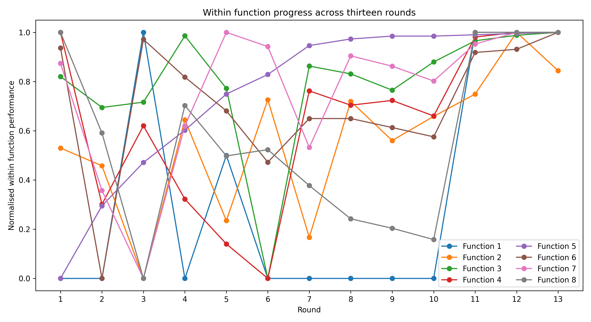
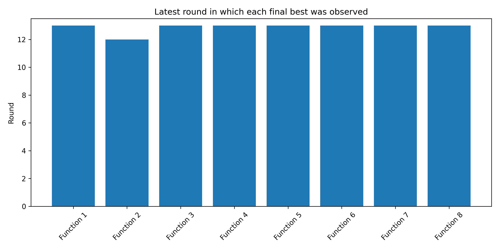

# Imperial BBO Capstone


| [**▶ CLICK ME: OPEN THE LIVE IMPERIAL BBO VISUAL BOOK**](https://01a04a5b-864f-4cec-e841-84e7f7931b5d.share.connect.posit.cloud/) |
|:---:|

The live book opens directly in your browser. It includes the Week, Function, Scientific Atlas, BBR and PDHIS reading routes.

## Enter the project

This repository tells two connected stories. The first is the official thirteen-round Imperial BBO Capstone. The second begins after the challenge and asks what more can be resolved from the completed evidence. Choose the depth that suits you.

| **Interactive Visual Book** | **Assessment Record** | **Reproduce the Work** |
|:---:|:---:|:---:|
| [**Open the Live Visual Book →**](https://01a04a5b-864f-4cec-e841-84e7f7931b5d.share.connect.posit.cloud/) | [**Open Components 25.1, 25.2 and 25.3 →**](Module_25_Final_BBO_Submission/README.md) | [**Open the verified notebook →**](Module_25_Final_BBO_Submission/25_3_GitHub_Final_Submission/FINAL_CAPSTONE_NOTEBOOK.ipynb) |
| Read by week, function or scientific theme. Continue into Black Box Resolution and PDHIS. | Review the retrospective, successful strategies, datasheet, model card and repository audit. | Inspect the data, calculations, figures and reproducibility instructions. |

> **Interactive status:** The public Shiny deployment is live. Use the CLICK ME link above to open the complete interactive Visual Book. GitHub retains the documented evidence, source code and reproducibility record.

### The verified record at a glance

| 13 rounds | 8 functions | 175 starter observations | 104 prospective queries | 279 observations retained |
|:---:|:---:|:---:|:---:|:---:|
| One weekly decision cycle | 2 to 8 dimensions | Supplied starting evidence | One query per function per round | Complete audited evidence |

### Final retained participant-query results

| F1 | F2 | F3 | F4 | F5 | F6 | F7 | F8 |
|---:|---:|---:|---:|---:|---:|---:|---:|
| `0.025559` | `0.733525` | `-0.056851` | `-4.359875` | `4440.957217` | `-0.607156` | `1.380930` | `9.580240` |

These values are the strongest results produced by the participant-selected queries. They do not claim the unknown mathematical global optima.

### Run the Visual Book

```bash
python -m pip install -r BBO_Visual_Book_Shiny/requirements.txt
python -m shiny run BBO_Visual_Book_Shiny/app.py
```

Open the local address printed by Shiny. The cover presents two routes: **Imperial BBO Capstone** and **Above and Beyond BBO**. The second route separates the **Above BBO BBR Book** from the **Beyond BBO PDHIS Book**.

---

## Bayesian Black Box Optimisation Portfolio

**Author:** Dr Nandakumar Theekkootu Pisharam  
**Repository status:** Public  
**Default branch:** `main`

## What this project was about

This project records a thirteen-round search for strong inputs to eight hidden mathematical functions. Imperial supplied 175 starting observations. Each week, I selected one new input per function, submitted eight queries through the course portal and used the returned outputs to plan the next round. The approach changed as evidence accumulated: broad exploration gave way to local refinement, recovery of earlier strong points, boundary testing, replication and stopping. Across 104 prospective queries, Round 13 produced new best results for Functions 3, 5 and 6. The repository preserves the data, unsuccessful trials, analysis code, figures, decisions, limitations and reproducibility checks.

## Final assessment quick start

The five Component 25.3 requirements are available directly from this page:

1. **Clear, reproducible code:** [Final capstone notebook](Module_25_Final_BBO_Submission/25_3_GitHub_Final_Submission/FINAL_CAPSTONE_NOTEBOOK.ipynb) and [reproducibility guide](Module_25_Final_BBO_Submission/25_3_GitHub_Final_Submission/FINAL_REPRODUCIBILITY.md)
2. **Complete dataset:** [279-observation capstone dataset](BBO_Dashboard/data/complete_internal_evidence.csv) and [final datasheet](Module_25_Final_BBO_Submission/25_3_GitHub_Final_Submission/FINAL_CAPSTONE_DATASHEET.md)
3. **Complete model card:** [Final capstone model card](Module_25_Final_BBO_Submission/25_3_GitHub_Final_Submission/FINAL_CAPSTONE_MODEL_CARD.md)
4. **Non-technical explanation:** the 100-word summary above
5. **Organisation and documentation:** [Module 25 evidence hub](Module_25_Final_BBO_Submission/README.md) and [completed repository audit](Module_25_Final_BBO_Submission/25_3_GitHub_Final_Submission/REPOSITORY_AUDIT.md)

## The official assessment record

The assessed experiment is preserved in `Week_01` through `Week_13`. Module 25 contains the final assessment material. It is not an additional optimisation round.

The later Black Box Resolution and Advanced Extension work is separate research completed after the capstone. It did not produce or alter any of the official thirteen-round results.

### Final assessment material

- [Module 25: Final BBO Capstone Submission](Module_25_Final_BBO_Submission/README.md)
- [25.1 Retrospective Evidence Map](Module_25_Final_BBO_Submission/25_1_Retrospective/EVIDENCE_MAP.md)
- [25.2 Successful Optimisation Strategies Evidence Map](Module_25_Final_BBO_Submission/25_2_Successful_Optimisation_Strategies/EVIDENCE_MAP.md)
- [25.3 Repository Audit](Module_25_Final_BBO_Submission/25_3_GitHub_Final_Submission/REPOSITORY_AUDIT.md)
- [Final Capstone Datasheet](Module_25_Final_BBO_Submission/25_3_GitHub_Final_Submission/FINAL_CAPSTONE_DATASHEET.md)
- [Final Capstone Model Card](Module_25_Final_BBO_Submission/25_3_GitHub_Final_Submission/FINAL_CAPSTONE_MODEL_CARD.md)
- [Final Reproducibility Guide](Module_25_Final_BBO_Submission/25_3_GitHub_Final_Submission/FINAL_REPRODUCIBILITY.md)
- [Final Verified Winner Summary](Module_25_Final_BBO_Submission/Final_13_Round_Evidence/FINAL_RESULTS_SUMMARY.csv)

## How the search developed

The same strategy did not suit every function. Four practical actions became important:

- **Explore:** test a different area when there was not enough evidence.
- **Refine:** make a small change near a promising result.
- **Recover:** return towards an earlier strong point after a poor result.
- **Retain:** keep a result when repeated tests showed that further movement was unlikely to help.

Clustering helped identify recurring regions in the later rounds. Principal component analysis helped show whether several coordinates were moving together. These methods supported the decisions, but the returned scores remained the main evidence.

## Final results after thirteen rounds

Round 13 produced new best results for Functions 3, 5 and 6. Functions 1, 4, 7 and 8 kept their strongest earlier results. Function 2 performed best in Week 12, then declined after another small change in Week 13.

| Function | Best participant-query output | Best query week or weeks | Plain explanation |
| --- | ---: | --- | --- |
| F1 | `0.025559285339829783` | 3, 11, 12, 13 | The same best result was confirmed several times |
| F2 | `0.7335252043269003` | 12 | The next small move made the result worse |
| F3 | `-0.05685061601567621` | 13 | The final small adjustment improved the result |
| F4 | `-4.359874926582439` | 1, 12, 13 | An early best point was recovered and confirmed |
| F5 | `4440.957216598753` | 13 | Careful movement towards the boundary kept improving the score |
| F6 | `-0.6071562248604215` | 13 | The best result was found, but repeated tests showed variation |
| F7 | `1.3809299933612855` | 5, 12, 13 | An earlier best point was recovered and confirmed |
| F8 | `9.58024` | 1, 11, 12, 13 | The same best result was confirmed several times |

These are the strongest results produced by the participant-selected queries during the thirteen authorised rounds. Starter-data maxima are reported separately in the final notebook. None proves that the mathematical global optimum was found.

### Final analytical figures



*Each function is normalised only against its own observed participant-query range. The figure shows timing and convergence, not comparable raw magnitude across functions.*



*Later bars indicate that the final winning query was still being found or reconfirmed near the end of the challenge.*

## What the results taught us

Function 5 showed the clearest sustained improvement. Its score rose from `1415.8763939603884` in Week 1 to `4440.957216598753` in Week 13. The search improved because it followed a consistent direction while the evidence remained favourable.

Function 2 showed why small changes are not automatically safe. Week 12 found a new best, but the next nearby point performed worse. Function 6 raised a different concern because the same coordinate returned different values on separate occasions. This means repeatability must be checked for each function rather than assumed.

## Key weekly analysis

- [Week 09: Module 21 analysis](Week_09/README.md)
- [Week 10: clustering and strategy refinement](Week_10/README.md)
- [Week 11: principal component comparison and Week 12 decision](Week_11/README.md)
- [Week 12: verified outcome and capstone reflection](Week_12/README.md)
- [Week 13: final round analysis](Week_13/README.md)
- [Week 13 final strategy outcome](Week_13/FINAL_STRATEGY_OUTCOME.md)
- [Week 13 final capstone synthesis](Week_13/FINAL_CAPSTONE_SYNTHESIS.md)
- [Week 13 RL-informed decision experiment](Week_13/RL_DECISION_EXPERIMENT/README.md)

## Weekly record

| Round | Documentation |
| --- | --- |
| Week 01 | [README](Week_01/README.md) |
| Week 02 | [README](Week_02/README.md) |
| Week 03 | [README](Week_03/README.md) |
| Week 04 | [README](Week_04/README.md) |
| Week 05 | [README](Week_05/README.md) |
| Week 06 | [README](Week_06/README.md) |
| Week 07 | [README](Week_07/README.md) |
| Week 08 | [README](Week_08/README.md) |
| Week 09 | [README](Week_09/README.md) |
| Week 10 | [README](Week_10/README.md) |
| Week 11 | [README](Week_11/README.md) |
| Week 12 | [README](Week_12/README.md) |
| Week 13 | [README](Week_13/README.md) |

## Reproducing the final assessment results

Run the following commands from the repository root:

```bash
python -m pip install -r requirements-final.txt
python tools/repository_audit.py
python Week_13/week_13_analysis.py
python Week_13/generate_week_13_figures.py
```

For a guided route through the data and final calculations, open the [Final Capstone Notebook](Module_25_Final_BBO_Submission/25_3_GitHub_Final_Submission/FINAL_CAPSTONE_NOTEBOOK.ipynb).

### Interactive Visual Book

No installation is required for readers. Open the complete public application directly:

| [**▶ CLICK ME: OPEN THE LIVE IMPERIAL BBO VISUAL BOOK**](https://01a04a5b-864f-4cec-e841-84e7f7931b5d.share.connect.posit.cloud/) |
|:---:|

The live Shiny book is the main interactive edition. It reads the audited evidence without changing the official record. The earlier [Streamlit assessment dashboard](BBO_Dashboard/README.md) remains in the repository as reproducible supporting code, but readers do not need to run it.

The audit checks the required assessment files, the weekly navigation, the internal links and unfinished placeholders. The analysis rebuilds the thirteen-round history from the recorded evidence and reproduces the final comparisons.

See the [Final Reproducibility Guide](Module_25_Final_BBO_Submission/25_3_GitHub_Final_Submission/FINAL_REPRODUCIBILITY.md) for full instructions.

## What happened after the capstone

The [Advanced Extension Series](Advanced_Extension_Series/README.md) began after Week 13. It uses the completed record to ask further research questions without changing the assessed evidence.

The [Black Box Resolution research](Advanced_Extension_Series/BBD_Black_Box_Decryption/README.md) uses the completed evidence to compare and reject candidate explanations of the hidden functions. The legacy folder name contains `BBD`, but the assessment-facing term is Black Box Resolution. These later studies are clearly labelled as post-capstone work.

The `PGC` and `PFRAMOS` directories contain additional validation and research material. See [Extended Research and Validation](EXTENDED_RESEARCH_AND_VALIDATION.md).
