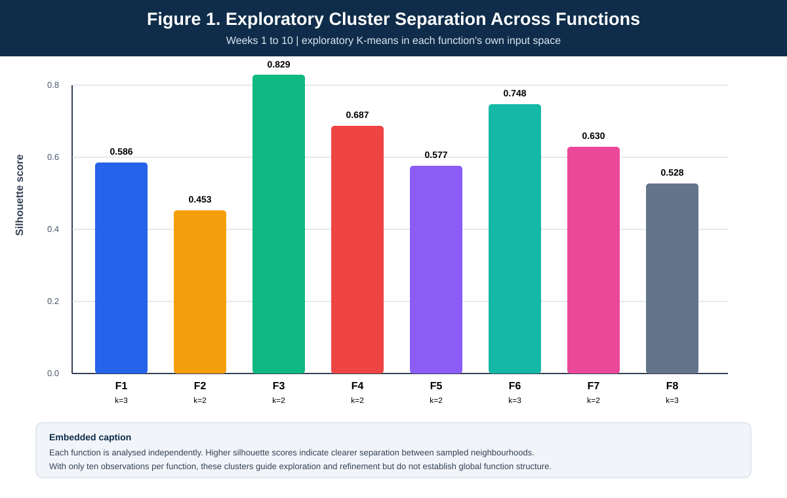
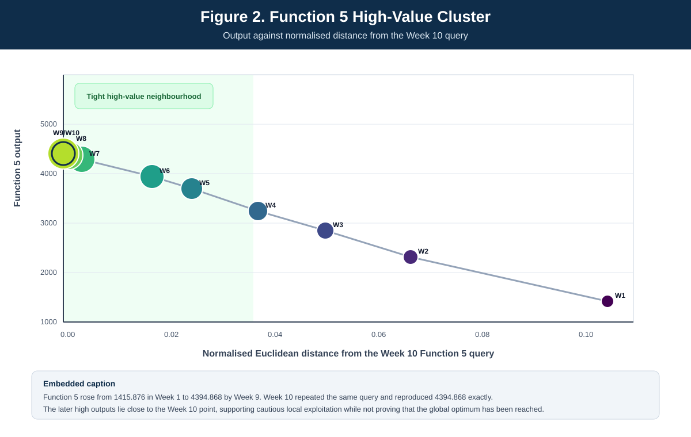
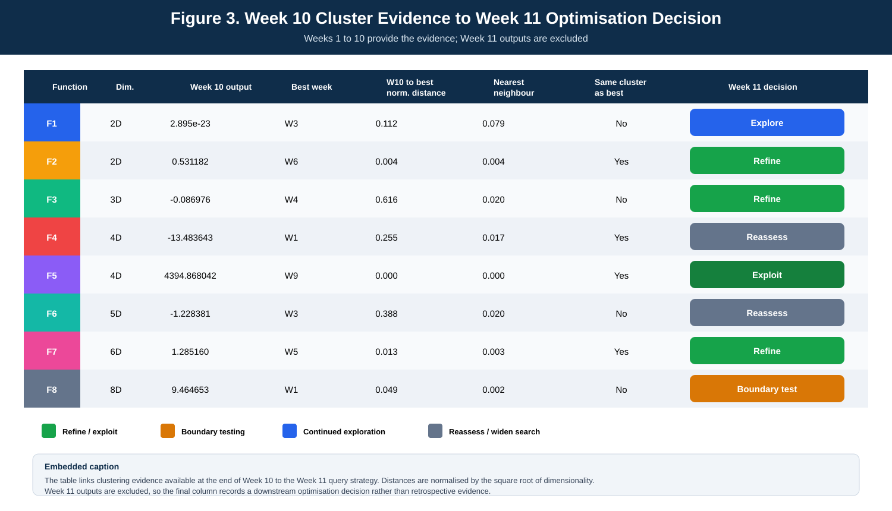

# Week 10 Clustering Analysis

## Purpose

Week 10 introduced an explicit clustering perspective to the accumulated optimisation evidence. The aim was not to claim that ten observations recover the hidden response surfaces. Clustering was used as an exploratory decision aid to identify recurring neighbourhoods, compact high performing regions, weak regions, possible outliers and areas where further exploration remained necessary.

Only observations available by the end of Week 10 are used. Week 11 outputs are excluded. The Week 11 query vectors are treated only as downstream decisions informed by the Week 10 evidence.

## Authoritative data source

The clustering workflow reads the exact cumulative history stored in:

`PFRAMOS/data/recovered_exact_history.csv`

The Week 10 analysis filters that file to Weeks 1 to 10, giving 80 observations in total, ten for each of the eight functions. The raw Week 10 inputs and outputs remain independently preserved in `week_10_inputs.csv` and `week_10_results.csv`.

## Analytical principle

Each hidden function is analysed independently because the functions have different dimensionalities and output scales. Input coordinates are bounded on [0,1], so Euclidean distance provides a transparent measure of neighbourhood proximity within each function. Distances used for the cross-function summary are normalised by the square root of dimensionality.

The analysis considers four related signals:

1. proximity of query vectors in input space;
2. recurrence of strong or weak outputs among nearby observations;
3. concentration or dispersion of later queries as the search develops;
4. whether a strong observation is supported by neighbouring evidence or remains isolated.

K-means is used only as an exploratory partitioning tool. Candidate cluster counts are restricted to k = 2 or 3, and the best exploratory partition is selected by silhouette score. Nearest-neighbour distance, best-observation distance and within-function output rank are retained alongside the cluster labels so that interpretation does not depend on one algorithm alone.

## Week 10 interpretation

| Function | Week 10 evidence | Clustering interpretation | Decision consequence |
| --- | --- | --- | --- |
| Function 1 | Output remained effectively zero after movement | No convincing productive cluster | Continue exploration |
| Function 2 | Improved to 0.5311818841205426 | Emerging productive neighbourhood | Refine locally |
| Function 3 | Improved to -0.08697581687486715 | More favourable local grouping, still uncertain | Continue targeted refinement |
| Function 4 | Declined to -13.483642655031158 | Week 10 neighbourhood not supported | Reassess direction |
| Function 5 | Repeated 4394.868042481448 at the same boundary point | Strongest evidence of a stable high performing neighbourhood | Exploit carefully |
| Function 6 | Declined to -1.2283806967341901 | Current local direction weakened | Reassess neighbourhood |
| Function 7 | Remained positive at 1.285160161342515 with a small decline | Productive, relatively tight neighbourhood | Refine conservatively |
| Function 8 | Remained high at 9.4646525 with a small decline | Stable region with evidence near the boundary | Boundary test |

## Figure 1. Exploratory cluster separation



Each function has its own consistent colour. The silhouette scores summarise how clearly the ten sampled query vectors can be partitioned into exploratory groups. The figure should be read as a comparison of sampled neighbourhood structure, not as evidence that the true hidden function has exactly that number of natural clusters.

## Figure 2. Function 5 high-value cluster



Function 5 provides the clearest practical clustering case. Its output increased from `1415.8763939603884` in Week 1 to `4394.868042481448` in Week 9. Week 10 deliberately repeated the Week 9 input `0.120000,0.997000,0.999800,0.999800` and reproduced the same output exactly. The later high-output observations are concentrated close to this boundary point, supporting cautious local exploitation without proving that the global optimum has been reached.

## Figure 3. Cluster evidence to Week 11 decision



The decision colours are deliberately restrained:

- green indicates refine or exploit;
- amber indicates boundary testing;
- blue indicates continued exploration;
- grey indicates reassessment or a wider search.

This figure makes the decision trail explicit by linking dimensionality, Week 10 output, best observed week, normalised distance to the best observation, nearest-neighbour distance and cluster agreement to the next-query strategy.

## Negative evidence and boundaries

Clustering was also used to interpret poor results. A weak observation is not automatically noise. If nearby queries repeatedly perform poorly, they help define a low performing region. Conversely, an isolated strong result is not automatically treated as a cluster centre. Repeated behaviour among nearby observations receives more weight than a single exceptional point.

This distinction is important for Functions 3, 4 and 6. Their negative outputs are not grouped simply because they share a sign. Input location, proximity and repeated behaviour are considered together.

## Link to the Week 11 submission

The Week 10 clustering interpretation influenced both direction and step size. Supported neighbourhoods were refined, apparently flat regions were tested cautiously at their boundaries, and unresolved functions retained greater exploratory movement.

The evidence chain is therefore:

`Weeks 1 to 10 observations -> neighbourhood and cluster analysis -> interpretation -> exploration/refinement decision -> Week 11 query`

The Week 11 query is a downstream decision record, not evidence used to construct the Week 10 clusters.

## Reproducibility

Run:

```bash
python Week_10/week_10_clustering_analysis.py
python Week_10/generate_week_10_clustering_figures.py
```

The first script regenerates the observation-level cluster summary from the exact recovered history. The second regenerates the three colour figures and `week_10_clustering_figure_source.csv` from the same authoritative source.

Expected analytical outputs:

- `Week_10/week_10_cluster_summary.csv`
- `Week_10/week_10_clustering_figure_source.csv`
- `Week_10/week_10_clustering_figure_1_cluster_separation_colour.png`
- `Week_10/week_10_clustering_figure_1_cluster_separation_colour.svg`
- `Week_10/week_10_clustering_figure_2_function5_cluster_colour.png`
- `Week_10/week_10_clustering_figure_2_function5_cluster_colour.svg`
- `Week_10/week_10_clustering_figure_3_decision_evidence_colour.png`
- `Week_10/week_10_clustering_figure_3_decision_evidence_colour.svg`

## Limitations

Ten observations per function remain sparse, especially in four to eight dimensions. Adaptive sampling also means the observations are not independent or uniformly distributed. Apparent clusters may reflect the optimisation policy as well as the hidden function. K-means assumes relatively compact groups and should not be interpreted as proof of natural cluster structure. Clustering is therefore used here as exploratory evidence for query selection, not as a claim that the global geometry or global optimum has been established.
